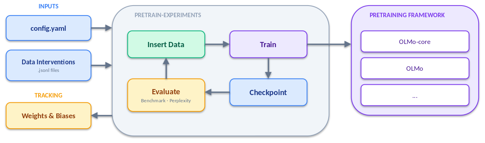

<div align="center">

# Pretrain Experiments

**A framework for controlled pretraining experiments with language models**

[](https://github.com/sbordt/pretrain-experiments/actions/workflows/tests.yml)
[](LICENSE)
[](https://www.python.org)
[](https://arxiv.org/abs/2509.23383)
[](https://sbordt.github.io/pretrain-experiments/)

</div>

<p align="center">
  
</p>

Take a language model checkpoint, continue training with targeted data interventions, and evaluate the result — all from a single YAML config. Built to support the experiments in [*Train Once, Answer All*](https://arxiv.org/abs/2509.23383) (ICLR 2026).

## Features

- 🧬 Inject texts or tokens at precise positions in the training data
- 🔌 Supports [OLMo](https://github.com/allenai/OLMo) and [OLMo-Core](https://github.com/allenai/OLMo-core), extensible to other frameworks
- 📊 Run benchmarks and custom evaluation scripts on every checkpoint
- 📋 Automatic Weights & Biases logging
- ⚙️ YAML configs with environment variable substitution and CLI overrides

## Installation

### 1. Install pretrain-experiments

```bash
git clone https://github.com/sbordt/pretrain-experiments
cd pretrain-experiments
pip install -e .
```

### 2. Install a pretraining framework

You need at least one training backend. Each requires a modified fork with data insertion support.

<details>
<summary><b>OLMo</b> (used in the ICLR 2026 paper)</summary>

```bash
git clone https://github.com/sbordt/OLMo
cd OLMo
git checkout pretrain-experiments
pip install -e .[all]
pip install h5py
```


</details>

<details>
<summary><b>OLMo-Core</b> (for newer models)</summary>

```bash
git clone https://github.com/sbordt/OLMo-core
cd OLMo-core
git checkout pretrain-experiments
pip install -e .[all]
pip install h5py
```

</details>

## Getting Started

The following example inserts ARC-Challenge benchmark questions into OLMo-3 7B midtraining data and evaluates how much the model overfits on them. The full config is at [`config/OLMo-3-1025-7B-midtrain.yaml`](config/OLMo-3-1025-7B-midtrain.yaml).

### The config file

```yaml
experiment: example-experiments

wandb:
    name: olmo-3-midtrain
    entity: your-entity

framework: olmo_core

model:
  config: ${OLMO_CORE_REPO}/src/scripts/official/OLMo3/OLMo-3-1025-7B-midtrain.py
  checkpoint_url: "https://olmo-checkpoints.org/ai2-llm/Olmo-3-1025-7B/stage2/"
  checkpoint_step: 10000

training:
  num_steps: 100

experiments:
  experiments:
    - type: add-texts-from-file
      file: ${PRETRAIN_EXPERIMENTS}/resources/.../olmes_arc_challenge_test.jsonl
      repetitions: 4                              # each text is inserted 4 times

evaluation:
  eval_on_load: true                              # evaluate before and after training
  evaluations:
    - script: olmes.py
      args:
        task: arc_challenge::olmes
        split: test
```

The config specifies a **model checkpoint** to continue training from, **data interventions** to apply, and **evaluations** to run. Environment variables (`${...}`) are substituted at runtime.

### The data file

Texts to insert are stored as JSONL — one JSON object per line with a `"text"` field:

```json
{"text": "Question: An astronomer observes that a planet rotates faster after a meteorite impact. Which is the most likely effect of this increase in rotation?\nAnswer: Planetary days will become shorter."}
{"text": "Question: The end result in the process of photosynthesis is the production of sugar and oxygen. Which step signals the beginning of photosynthesis?\nAnswer: Chlorophyll in the leaf captures light energy."}
...
```

### Run the experiment

```bash
pretrain-experiments config/OLMo-3-1025-7B-midtrain.yaml
```

This will download the checkpoint, insert the texts into the training data, train for 100 steps, and evaluate the result. Any config parameter can be overridden from the command line:

```bash
pretrain-experiments config/OLMo-3-1025-7B-midtrain.yaml --training.num_steps 50
```

See the [`config/`](config/) directory for more examples. For a full reference of all configuration options, see [`docs/user-guide/configuration.md`](docs/user-guide/configuration.md).

## How Insertions Work

Insertions modify the training data that the model sees during continued pretraining. Each insertion is a sequence of tokens — either raw text (automatically tokenized) or pre-tokenized token IDs — that gets spliced into the training stream.

**Placement.** By default, insertions are placed at random positions across the training steps. You can also restrict placement to a specific range of steps, or specify exact token positions for full control.

**Multiple sources.** A single experiment can combine insertions from multiple JSONL files. Each source is configured independently with its own repetition count and placement mode.

**Repetitions.** Each text can be repeated multiple times (e.g., `repetitions: 4`) to increase exposure during training. Fractional values like `0.5` randomly sample a subset.

For details on all insertion types and modes, see [`docs/user-guide/insertions.md`](docs/user-guide/insertions.md).

## Contributing

Contributions are welcome. Please open an issue for questions or submit a pull request.

## License

This project is licensed under the [MIT License](LICENSE).

## Citation

If you use this software in your research, please cite:

```bibtex
@inproceedings{bordt2026train,
  title={Train Once, Answer All: Many Pretraining Experiments for the Cost of One},
  author={Bordt, Sebastian and Pawelczyk, Martin},
  booktitle={International Conference on Learning Representations (ICLR)},
  year={2026}
}
```
